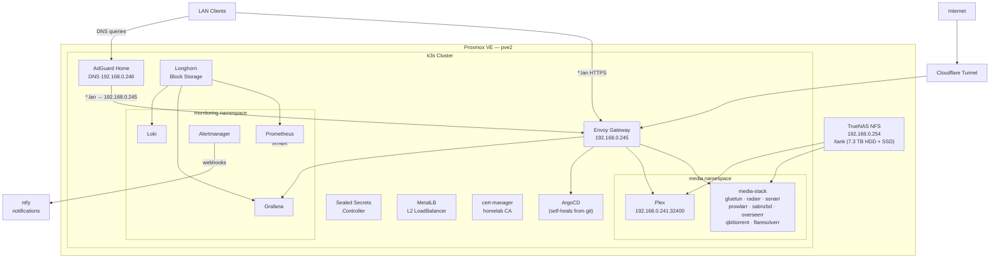

# homelab-k8s

[](https://kubernetes.io)
[](https://k3s.io)
[](https://argoproj.github.io/cd/)
[](https://gateway.envoyproxy.io/)
[](https://longhorn.io)

Single source of truth for my homelab Kubernetes platform. Ansible bootstraps k3s on Proxmox VMs, and ArgoCD continuously reconciles every service and workload from this repo.

---

## Architecture

This homelab is one of three separate lab workspaces that temporarily share two physical servers.
The homelab stays focused on personal services and the k3s/GitOps platform on `pve2`; the
cyberlab and AI lab keep their own repositories and operational boundaries. See
[Shared server context](docs/shared-server-context.md) and
[Lab organization and Kubernetes strategy](docs/lab-organization-and-kubernetes-strategy.md).

### Infrastructure Layer

| Area | Implementation | Notes |
| :--- | :--- | :--- |
| Virtualization | Proxmox VE | Hosts all control-plane and worker VMs |
| Bootstrap | Ansible (k3s-ansible) | Installs k3s, labels nodes, mounts NFS |
| GitOps | ArgoCD | Self-heals cluster state from this repo |
| Secrets | Sealed Secrets | Encrypted secrets committed safely to git |

### Kubernetes Platform

| Domain | Component |
| :--- | :--- |
| Runtime | k3s |
| GitOps | ArgoCD + ArgoCD Image Updater |
| Ingress | Envoy Gateway (Gateway API) |
| Load Balancer | MetalLB (L2 mode) |
| DNS / Ad-block | AdGuard Home |
| External Connectivity | cloudflared (Cloudflare Tunnel) |
| PKI | cert-manager with homelab self-signed CA |
| Secrets | Sealed Secrets |
| Block Storage | Longhorn |
| Network Storage | TrueNAS (NFS — `/tank`) |
| Observability | Prometheus, Grafana, Loki, Promtail, Alertmanager |
| Notifications | ntfy |

### Cluster Topology

| Node | Role | Workloads |
| :--- | :--- | :--- |
| `k3s-control-plane` | Control plane | etcd, API server, scheduler |
| `k3s-worker-*` | General workers | Infra, apps, monitoring |

**MetalLB address pool:** `192.168.0.240 – 192.168.0.250`

| IP | Service |
| :--- | :--- |
| `192.168.0.241` | Plex media server (direct LAN, port 32400) |
| `192.168.0.245` | Envoy Gateway (all `.lan` HTTPS + HTTP redirect) |
| `192.168.0.246` | AdGuard DNS (UDP/TCP 53) |



---

## GitOps Lifecycle

The cluster is fully reconciled through a three-level ArgoCD sync chain:

```
bootstrap/root-app.yaml          ← apply once manually after ArgoCD install
    └── categories/
        ├── infrastructure.yaml  ← ApplicationSet (sync-wave -5)
        │       discovers argocd-apps/infrastructure/**/*-{helm,git}-app.yaml
        │       deploys: namespaces, sealed-secrets, cert-manager, metallb,
        │                longhorn, envoy-gateway, ingress, monitoring, storage …
        └── applications.yaml    ← ApplicationSet (sync-wave 0)
                discovers argocd-apps/apps/**/*-git-app.yaml
                deploys: adguard-home, media-stack, plex, homepage, ntfy
```

**Sync waves ensure ordering:**
- Wave `-5` — infrastructure (MetalLB, Longhorn, cert-manager, Envoy Gateway)
- Wave `-3` — ArgoCD config, namespaces, network policies
- Wave `-1` — Sealed Secrets (secrets exist before workloads start)
- Wave `0`  — Applications
- Wave `1`  — Monitoring

**Bootstrap a fresh cluster:**

```bash
# 1. Install k3s via Ansible
cd provisioning && ansible-playbook playbooks/install-k3s.yml

# 2. Install ArgoCD (helm or manifests)
kubectl create namespace argocd
kubectl apply -n argocd -f https://raw.githubusercontent.com/argoproj/argo-cd/stable/manifests/install.yaml

# 3. Apply the root app — ArgoCD takes over from here
kubectl apply -f bootstrap/root-app.yaml
```

---

## Networking

All LAN services are reachable at `<service>.lan` via Envoy Gateway. AdGuard Home handles DNS and rewrites every `.lan` hostname to `192.168.0.245`.

TLS is terminated at the gateway using a cert-manager-issued wildcard certificate (`*.lan`) signed by the homelab self-signed CA. Install the CA cert (`homelab-ca.crt`) in your browser/OS trust store for the green padlock.

| Hostname | Service | Namespace |
| :--- | :--- | :--- |
| `home.lan` | Homepage dashboard | `networking` |
| `adguard.lan` | AdGuard Home UI | `networking` |
| `ntfy.lan` | ntfy notifications | `networking` |
| `argocd.lan` | ArgoCD UI (TLS passthrough) | `argocd` |
| `plex.lan` | Plex Web | `media` |
| `overseerr.lan` | Overseerr / Seerr | `media` |
| `radarr.lan` | Radarr | `media` |
| `sonarr.lan` | Sonarr | `media` |
| `prowlarr.lan` | Prowlarr | `media` |
| `sabnzbd.lan` | SABnzbd | `media` |
| `qbittorrent.lan` | qBittorrent | `media` |
| `grafana.lan` | Grafana | `monitoring` |
| `prometheus.lan` | Prometheus | `monitoring` |
| `alertmanager.lan` | Alertmanager | `monitoring` |
| `loki.lan` | Loki | `monitoring` |

**NetworkPolicy baseline:** default-deny ingress per namespace, with explicit allow rules for same-namespace traffic, Envoy Gateway, and necessary cross-namespace calls.

---

## Workloads

### Media

The entire \*arr stack runs as a single pod (`media-stack`) in the `media` namespace. All containers share the `gluetun` VPN sidecar network namespace — outbound traffic is automatically tunnelled through NordVPN WireGuard. Plex runs as a separate deployment with direct MetalLB access on `192.168.0.241:32400`.

| App | Purpose |
| :--- | :--- |
| Plex | Media server (Intel iGPU transcode via i915) |
| Radarr | Movie automation |
| Sonarr | TV automation |
| Prowlarr | Indexer aggregation |
| SABnzbd | Usenet downloader |
| qBittorrent | Torrent client (VPN-only via gluetun) |
| Overseerr | Request management |
| FlareSolverr | Cloudflare bypass for Prowlarr |

### Platform

| App | Purpose |
| :--- | :--- |
| AdGuard Home | DNS filtering + `.lan` rewrites |
| Homepage | Cluster dashboard with live widget data |
| ntfy | Self-hosted push notifications (Alertmanager webhooks) |
| cloudflared | Cloudflare Tunnel — external access without open ports |

---

## Observability

| Component | Role |
| :--- | :--- |
| Prometheus | Metrics scraping (pods, nodes, cAdvisor, Loki, Alertmanager) |
| Grafana | Dashboards — community dashboards auto-provisioned on start |
| Loki | Log aggregation |
| Promtail | Log shipper DaemonSet (all nodes) |
| Alertmanager | Alert routing → ntfy webhooks |
| node-exporter | Node-level hardware metrics (DaemonSet) |
| cAdvisor | Container resource metrics (DaemonSet) |

**Active alert rules:**

| Alert | Condition | Severity |
| :--- | :--- | :--- |
| `NodeDiskSpaceLow` | Root FS > 80% for 5 m | warning |
| `NodeMemoryPressure` | Memory > 90% for 5 m | warning |
| `NodeHighLoad` | load15/CPU > 2 for 10 m | warning |
| `PodCrashLooping` | > 3 restarts in 30 m | critical |
| `ContainerOOMKilled` | Container terminated OOMKilled | warning |
| `PVCNearlyFull` | PVC > 85% used for 5 m | warning |
| `PrometheusTargetDown` | Scrape target unreachable for 5 m | warning |
| `CertificateExpiringSoon` | TLS cert expires < 14 days | warning |

All alerts route to ntfy at `ntfy.lan/homelab-alerts`.

---

## Storage

| Type | Backend | Used by |
| :--- | :--- | :--- |
| Longhorn (RWO) | Local disk on workers | Prometheus (10 Gi), Grafana (2 Gi), Loki (10 Gi), media app configs |
| NFS (RWX) | TrueNAS `/tank` at `192.168.0.254` | Movies (4 Ti), TV (4 Ti), Downloads (75 Gi, SSD) |

Longhorn volumes have daily snapshots with 7-day retention via `RecurringJob`.

**Note:** Movies and TV are on spinning HDD; downloads land on SSD for speed. Because these are different filesystems, \*arr apps copy files instead of hardlinking on import.

---

## Secrets

All secrets are encrypted with [Sealed Secrets](https://github.com/bitnami-labs/sealed-secrets) before being committed to git. Secrets deploy at sync-wave `-1` to guarantee they exist before any workload starts.

To re-seal a secret:
```bash
kubectl create secret generic my-secret --from-literal=key=value \
  --dry-run=client -o yaml | kubeseal -o yaml > sealed-secret.yaml
```

---

## Repository Map

| Path | Purpose |
| :--- | :--- |
| `bootstrap/` | Root ArgoCD Application — apply once to bootstrap the cluster |
| `categories/` | ApplicationSets for `infrastructure` (wave -5) and `apps` (wave 0) |
| `argocd-apps/` | Per-service Application descriptors consumed by the ApplicationSets |
| `manifests/apps/` | Raw Kubernetes manifests for homelab applications |
| `manifests/infra/` | Raw Kubernetes manifests for platform infrastructure |
| `provisioning/` | Ansible playbooks for k3s install and node setup |
| `schemas/` | Validation schemas for custom GitOps descriptor files |
| `scripts/` | Utility scripts (ArgoCD CLI helpers) |

See [GitOps organization](docs/gitops-organization.md) for the descriptor contract and service onboarding workflow.

## Lab Boundaries

| Workspace | Owns | Homelab relationship |
| :--- | :--- | :--- |
| `homelab` | personal services, k3s, GitOps, ingress, observability, NAS/media workflows | This repository |
| `cyberlab` | isolated cyber range VMs, SOC, attack/defense scenarios, security case studies | May export metrics/status; not managed by homelab ArgoCD |
| `ailab` | model serving, RAG, agents, evals, lab assistants, AI demos | May reuse observability/ingress patterns; heavy runtimes should stay AI-owned |

Kubernetes is the homelab service runtime, not the universal control plane for all labs. Crossplane is deferred until there is a concrete self-service platform API worth testing.

---

*Maintained by [Isaac Wallace](https://github.com/isaacwallace123) · [isaacwallace.dev](https://isaacwallace.dev)*
