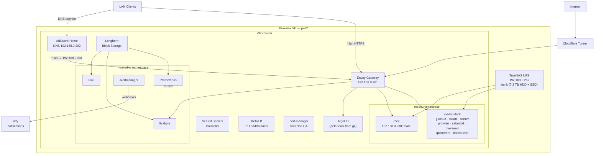

# homelab-k8s

[](https://kubernetes.io)
[](https://k3s.io)
[](https://argoproj.github.io/cd/)
[](https://gateway.envoyproxy.io/)
[](https://longhorn.io)

Single source of truth for my homelab Kubernetes platform. Terraform declares the VMs, Ansible
installs k3s, and ArgoCD continuously reconciles every service and workload from this repo.

The cluster spans **both** Proxmox hosts as one stretched k3s cluster: three control planes,
workers pooled by role, and physical hosts exposed as topology zones so storage replication and
pod spreading describe a real failure domain. On top of it, Crossplane serves a small platform
API — disposable scenario namespaces for the public Operations Arena, and the cloud tier's
Postgres databases and S3 buckets.

**Start here:** [docs/architecture/](docs/architecture/README.md)

---

## Architecture

This homelab is one of three separate lab workspaces sharing two physical servers. The homelab
owns the k3s/GitOps platform and personal services; the cyberlab and AI lab keep their own
repositories and operational boundaries. Homelab k8s VMs run on both Proxmox hosts — that is
compute placement, not a change of ownership, and those VMs are never attached to a cyberlab
range bridge. See
[Shared server context](docs/shared-server-context.md) and
[Lab organization and Kubernetes strategy](docs/lab-organization-and-kubernetes-strategy.md).

The public `homelab.isaacwallace.dev` frontend lives in the portfolio repository. This repository
will provide its isolated scenario runtime and sanitized event feed; see
[Public operations arena](docs/public-operations-arena.md).

### Infrastructure Layer

| Area | Implementation | Notes |
| :--- | :--- | :--- |
| Virtualization | Proxmox VE (×2 hosts) | One stretched cluster; hosts exposed as topology zones |
| VM lifecycle | Terraform (bpg/proxmox) | Map-driven; generates the Ansible inventory |
| Bootstrap | Ansible | Installs k3s, labels/taints nodes, tunes the kubelet |
| Platform API | Crossplane v2 | `LabRun` (arena), `Database` (CNPG), `Bucket` (Garage) |
| GitOps | ArgoCD | Self-heals cluster state from this repo |
| Secrets | Sealed Secrets | Encrypted secrets committed safely to git |

### Kubernetes Platform

| Domain | Component |
| :--- | :--- |
| Runtime | k3s |
| GitOps | ArgoCD + ArgoCD Image Updater |
| Ingress | Envoy Gateway (Gateway API) |
| Load Balancer | MetalLB (L2 mode) |
| DNS / Ad-block | AdGuard Home |
| External Connectivity | cloudflared (Cloudflare Tunnel) |
| PKI | cert-manager with homelab self-signed CA |
| Secrets | Sealed Secrets |
| Block Storage | Longhorn |
| Network Storage | TrueNAS (NFS — `/tank`) |
| Observability | Prometheus, Grafana, Loki, Promtail, Alertmanager |
| Notifications | ntfy |

### Cluster Topology

Placement is by label, never by node name. `topology.kubernetes.io/zone` is the physical Proxmox
host, so Longhorn replica anti-affinity and pod topology spread express a real failure domain.

| Node | Zone | Role | Pool |
| :--- | :--- | :--- | :--- |
| `k8s-cp-01` | pve2 | control plane | — |
| `k8s-cp-02` | pve2 | control plane | — |
| `k8s-cp-03` | cyberlab | control plane | — |
| `k8s-store-01` | pve2 | worker | `storage` — media, Plex (Arc A380), Longhorn |
| `k8s-infra-01` | pve2 | worker | `infra` — MetalLB, monitoring, Crossplane |

Quorum sits on `pve2` deliberately: with two physical hosts you get VM-level HA, not host-level,
and `pve2` also runs TrueNAS — losing it means storage is gone regardless. See
[docs/architecture/README.md](docs/architecture/README.md) §3.

**MetalLB pools** — see [networking](docs/architecture/networking.md):

| Pool | Range | Assignment |
| :--- | :--- | :--- |
| `platform-pool` | `.201 – .209` | Pinned — gateways, ArgoCD, AdGuard |
| `services-pool` | `.220 – .250` | Pinned — dashboards, media, monitoring |


```mermaid
flowchart TB
    User["LAN Clients"]
    CF["Cloudflare Tunnel"]
    Internet["Internet"]

    subgraph Proxmox["Proxmox VE — pve2"]
        NFS["TrueNAS NFS\n192.168.0.252\n/tank (7.3 TB HDD + SSD)"]

        subgraph K3s["k3s Cluster"]
            ArgoCD["ArgoCD\n(self-heals from git)"]
            SealedSecrets["Sealed Secrets\nController"]
            MetalLB["MetalLB\nL2 LoadBalancer"]
            Envoy["Envoy Gateway\n192.168.0.201"]
            AdGuard["AdGuard Home\nDNS 192.168.0.202"]
            CertManager["cert-manager\nhomelab CA"]
            Longhorn["Longhorn\nBlock Storage"]

            subgraph Media["media namespace"]
                MediaStack["media-stack\ngluetun · radarr · sonarr\nprowlarr · sabnzbd · overseerr\nqbittorrent · flaresolverr"]
                Plex["Plex\n192.168.0.230:32400"]
            end

            subgraph Monitoring["monitoring namespace"]
                Prometheus["Prometheus"]
                Grafana["Grafana"]
                Loki["Loki"]
                Alertmanager["Alertmanager"]
            end

        end
    end

    User -->|"*.lan HTTPS"| Envoy
    User -->|"DNS queries"| AdGuard
    AdGuard -->|"*.lan → 192.168.0.201"| Envoy
    Internet --> CF
    CF --> Envoy
    Envoy --> MediaStack
    Envoy --> Plex
    Envoy --> Grafana
    Envoy --> ArgoCD
    Longhorn --> Prometheus
    Longhorn --> Grafana
    Longhorn --> Loki
    NFS --> MediaStack
    NFS --> Plex
    Prometheus -->|"scrape"| Monitoring
    Alertmanager -->|"webhooks"| ntfy["ntfy\nnotifications"]
```

---

## GitOps Lifecycle

Every Application and AppProject is rendered by one umbrella chart from one values file:

```
bootstrap/root-app.yaml          ← apply once manually after ArgoCD install
    └── platform/                ← the umbrella chart
        ├── values/values-prod.yaml     ← THE PLATFORM, DECLARED ONCE
        ├── templates/applications.yaml ← generates up to 3 Apps per component
        ├── templates/projects.yaml     ← AppProjects, sourceRepos computed
        └── components/<name>/
            ├── pre-resources/   → <name>-pre        (tier − 1)
            ├── resources/       → <name>-resources  (tier + 1)
            └── values/          → chart values, version-controlled here
```

A component is **one values entry plus one directory**. Nothing else needs editing to add,
remove, or reorder it.

**Ordering is semantic, not numeric.** Components declare a tier; sync waves are derived:

| Tier | Wave | | Tier | Wave |
| :--- | ---: | :-- | :--- | ---: |
| `bootstrap` | 0 | | `platform` | 100 |
| `network` | 20 | | `platform-api` | 120 |
| `storage` | 40 | | `observability` | 140 |
| `security` | 60 | | `apps` | 160 |
| `ingress` | 80 | | `fleet` | 180 |

**Bootstrap a fresh cluster:**

```bash
# 1. Declare and create the VMs
terraform -chdir=provisioning/terraform apply     # also writes the Ansible inventory

# 2. Install k3s (HA control plane, then workers)
cd provisioning/ansible
ansible-playbook playbooks/cluster-ha.yml
ansible-playbook playbooks/join-agents.yml

# 3. Install ArgoCD (helm or manifests)
kubectl create namespace argocd
kubectl apply -n argocd -f https://raw.githubusercontent.com/argoproj/argo-cd/stable/manifests/install.yaml

# 4. Apply the root app — ArgoCD takes over from here
kubectl apply -f bootstrap/root-app.yaml
```

> Migrating an **existing** cluster to this layout? Read
> [docs/architecture/migration.md](docs/architecture/migration.md) first — the restructure renames
> most Applications, and to ArgoCD a rename is a delete plus a create.

---

## Networking

LAN HTTP services are exposed through Envoy Gateway at `192.168.0.201`. Internal hostname records
must be supplied by the router or client DNS configuration.

TLS is terminated at the gateway using a cert-manager-issued wildcard certificate (`*.lan`) signed by the homelab self-signed CA. Install the CA cert (`homelab-ca.crt`) in your browser/OS trust store for the green padlock.

| Hostname | Service | Namespace |
| :--- | :--- | :--- |
| `home.lan` | Homepage dashboard | `networking` |
| `ntfy.lan` | ntfy notifications | `networking` |
| `argocd.lan` | ArgoCD UI (TLS passthrough) | `argocd` |
| `plex.lan` | Plex Web | `media` |
| `overseerr.lan` | Overseerr / Seerr | `media` |
| `radarr.lan` | Radarr | `media` |
| `sonarr.lan` | Sonarr | `media` |
| `prowlarr.lan` | Prowlarr | `media` |
| `sabnzbd.lan` | SABnzbd | `media` |
| `qbittorrent.lan` | qBittorrent | `media` |
| `grafana.lan` | Grafana | `monitoring` |
| `prometheus.lan` | Prometheus | `monitoring` |
| `alertmanager.lan` | Alertmanager | `monitoring` |
| `loki.lan` | Loki | `monitoring` |

**NetworkPolicy baseline:** default-deny ingress per namespace, with explicit allow rules for same-namespace traffic, Envoy Gateway, and necessary cross-namespace calls.

---

## Workloads

### Media

The entire \*arr stack runs as a single pod (`media-stack`) in the `media` namespace. All containers share the `gluetun` VPN sidecar network namespace — outbound traffic is automatically tunnelled through NordVPN WireGuard. Plex runs as a separate deployment with direct MetalLB access on `192.168.0.230:32400`.

| App | Purpose |
| :--- | :--- |
| Plex | Media server (Intel iGPU transcode via i915) |
| Radarr | Movie automation |
| Sonarr | TV automation |
| Prowlarr | Indexer aggregation |
| SABnzbd | Usenet downloader |
| qBittorrent | Torrent client (VPN-only via gluetun) |
| Overseerr | Request management |
| FlareSolverr | Cloudflare bypass for Prowlarr |

### Platform

| App | Purpose |
| :--- | :--- |
| AdGuard Home | DNS filtering + `.lan` rewrites |
| Homepage | Cluster dashboard with live widget data |
| ntfy | Self-hosted push notifications (Alertmanager webhooks) |
| cloudflared | Cloudflare Tunnel — external access without open ports |

---

## Observability

| Component | Role |
| :--- | :--- |
| Prometheus | Metrics scraping (pods, nodes, cAdvisor, Loki, Alertmanager) |
| Grafana | Dashboards — community dashboards auto-provisioned on start |
| Loki | Log aggregation |
| Promtail | Log shipper DaemonSet (all nodes) |
| Alertmanager | Alert routing → ntfy webhooks |
| node-exporter | Node-level hardware metrics (DaemonSet) |
| cAdvisor | Container resource metrics (DaemonSet) |

**Active alert rules:**

| Alert | Condition | Severity |
| :--- | :--- | :--- |
| `NodeDiskSpaceLow` | Root FS > 80% for 5 m | warning |
| `NodeMemoryPressure` | Memory > 90% for 5 m | warning |
| `NodeHighLoad` | load15/CPU > 2 for 10 m | warning |
| `PodCrashLooping` | > 3 restarts in 30 m | critical |
| `ContainerOOMKilled` | Container terminated OOMKilled | warning |
| `PVCNearlyFull` | PVC > 85% used for 5 m | warning |
| `PrometheusTargetDown` | Scrape target unreachable for 5 m | warning |
| `CertificateExpiringSoon` | TLS cert expires < 14 days | warning |

All alerts route to ntfy at `ntfy.lan/homelab-alerts`.

---

## Storage

Current remediation guidance: [Storage pressure recovery plan (2026-07-18)](docs/storage-pressure-recovery-plan-2026-07-18.md).

| Class | Backend | Used by |
| :--- | :--- | :--- |
| `longhorn-replicated` *(default)* | Longhorn, 3 replicas, zone anti-affinity | Anything whose loss hurts — databases, ArgoCD, Grafana |
| `longhorn-single` | Longhorn, 1 replica | Rebuildable caches and scratch |
| `nfs-nas` (RWX) | TrueNAS `/tank` at `192.168.0.252` | Movies (4 Ti), TV (4 Ti), Downloads, backup targets |

Longhorn volumes have daily snapshots with 7-day retention via `RecurringJob`.

**Note:** Movies and TV are on spinning HDD; downloads land on SSD for speed. Because these are different filesystems, \*arr apps copy files instead of hardlinking on import.

---

## Secrets

All secrets are encrypted with [Sealed Secrets](https://github.com/bitnami-labs/sealed-secrets) before being committed to git. Secrets deploy at sync-wave `-1` to guarantee they exist before any workload starts.

To re-seal a secret:
```bash
kubectl create secret generic my-secret --from-literal=key=value \
  --dry-run=client -o yaml | kubeseal -o yaml > sealed-secret.yaml
```

---

## Repository Map

| Path | Purpose |
| :--- | :--- |
| `bootstrap/root-app.yaml` | The one manual `kubectl apply` |
| `platform/values/values-prod.yaml` | **The platform, declared once** — every component, its tier, its chart |
| `platform/templates/` | Application + AppProject generator, shared sync policy and ignoreDifferences |
| `platform/components/<name>/` | Per-component manifests and values |
| `platform/components/crossplane/` | Providers, functions, and the scoped identities (`homeops`, `cloud`, `garage`) |
| `platform/components/platform-api/` | `LabRun`, `Database`, and `Bucket` XRDs + Compositions |
| `provisioning/terraform/` | VMs on both Proxmox hosts; generates the Ansible inventory |
| `provisioning/ansible/` | k3s HA install, node labels/taints, kubelet tuning |
| `docs/architecture/` | How and why the platform is shaped this way |
| `scripts/` | Validation, composition tests, and one-time migration helpers |

**Scripts:**

| Script | Purpose |
| :--- | :--- |
| `validate-platform.sh` | Render the chart, check every component resolves, diff against the live cluster |
| `test-compositions.sh` | Render the Crossplane Compositions against mock composites |
| `pre-cutover.sh` | One-time: strip prune finalizers before the Application rename |
| `tf-state-migrate.sh` | One-time: move existing VMs into the Terraform `for_each` map |

## Lab Boundaries

| Workspace | Owns | Homelab relationship |
| :--- | :--- | :--- |
| `homelab` | personal services, k3s, GitOps, ingress, observability, NAS/media workflows | This repository |
| `cyberlab` | isolated cyber range VMs, SOC, attack/defense scenarios, security case studies | May export metrics/status; not managed by homelab ArgoCD |
| `ailab` | model serving, RAG, agents, evals, lab assistants, AI demos | May reuse observability/ingress patterns; heavy runtimes should stay AI-owned |

Kubernetes is the homelab service runtime, not the universal control plane for all labs.
Crossplane serves in-cluster self-service APIs only — it never manages Proxmox, VMs, DNS, or guest
lifecycle, which remain Terraform's and Ansible's. Cross-lab data flows one way: labs export
metrics and logs into the homelab observability hub, and nothing in the hub writes back. See
[cross-lab integration](docs/architecture/cross-lab.md).

---

*Maintained by [Isaac Wallace](https://github.com/isaacwallace123) · [isaacwallace.dev](https://isaacwallace.dev)*
